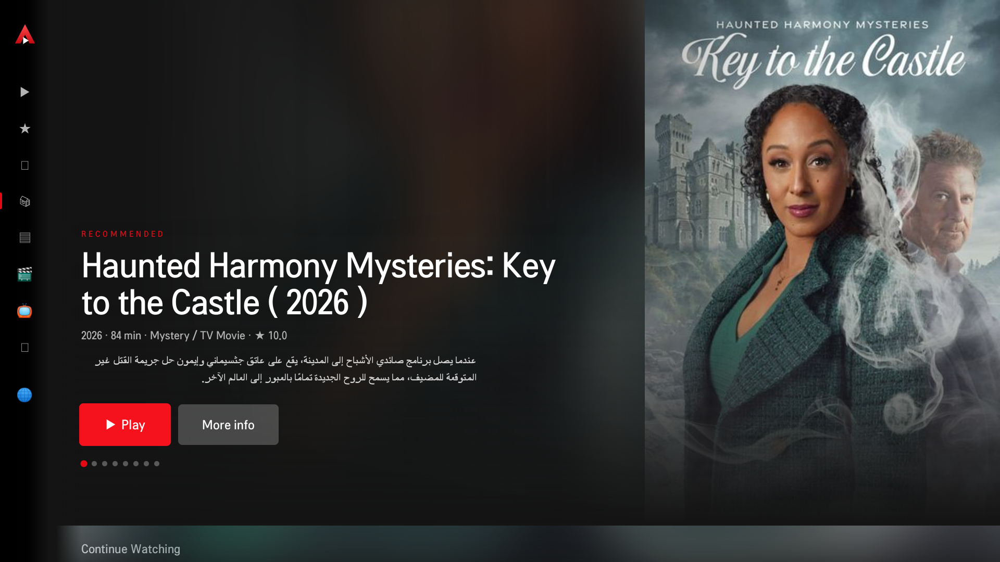
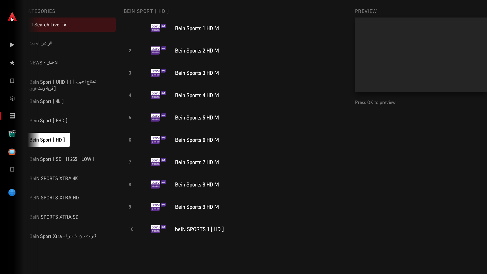
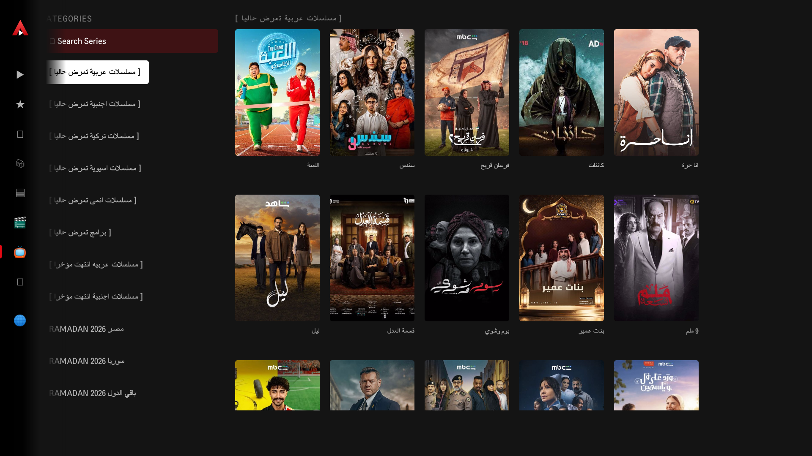
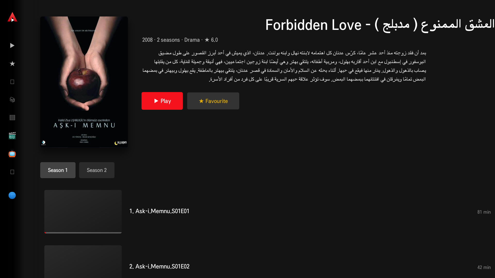

<div align="center">

# Arafa's IPTV

**An IPTV player for LG webOS TVs that refuses to give up on a stream.**

</div>



---

## Why another IPTV player

Most TV players treat a broken stream as the end of the world: the channel changes on
you, the episode "finishes" halfway through, or you get dropped back to a menu. On a
flaky line — which is most IPTV lines — that is the whole experience.

This one is built around one rule: **a problem is something to recover from, not to
exit on.**

| What happens | What this player does |
|---|---|
| The live stream is cut mid-match | Reconnects to the **same channel**. Never zaps to another one. |
| A film or episode is cut halfway | Tells a real ending from a cut, and **resumes at the same second**. |
| Every source for a title fails | Keeps the title on screen and retries; it does not leave. |
| A stall the engine cannot clear | Recovers instead of freezing on a dead frame. |
| The network is intercepted (captive portal, ISP notice) | Says exactly that, and reloads itself once the line is back. |
| The last episode ends | Offers the next one, or the title's page — never a bare exit. |

The provider behind the TV this was built on ends its live streams every 25–80
seconds. The player rides straight through it.

## Also

- **Netflix-style home** — hero, Continue Watching, favourites, rails.
- **Live TV, films and series** from any Xtream portal or M3U playlist, with EPG.
- **Free channels** built in (the public [iptv-org](https://github.com/iptv-org/iptv)
  list), so it is useful before you enter anything at all.
- **Six languages** — English, العربية, Español, Français, Türkçe, Deutsch — with RTL.
- **Made for a remote.** Every screen is d-pad first; the menu moves in ~27 ms and
  never navigates on its own.
- **Old TVs welcome.** Runs on webOS 4 (Chromium 53), not just recent panels.

## Screenshots

| Live TV | Series | Details |
|---|---|---|
|  |  |  |

## It ships no content

This is a **player**, like VLC. It contains no channels, no films, no accounts and no
links to any service. You bring your own Xtream portal or M3U playlist — whatever you
are legally entitled to use. The only playlist included by default is the public,
community-maintained iptv-org list.

## Install

You need an LG TV with **Developer Mode** enabled and the
[webOS CLI](https://webostv.developer.lge.com/develop/tools/cli-installation)
(`@webos-tools/cli`) on your machine.

```bash
git clone https://github.com/MUarafa/arafas-iptv.git
cd arafas-iptv

./build.sh                 # package the .ipk
./build.sh install         # package, then install on your set-up TVs
```

`./build.sh install` uses every device from `ares-setup-device`. To choose:

```bash
TV_DEVICES="living room" ./build.sh install
```

Or by hand:

```bash
ares-package app -o .
ares-install --device "<your device>" com.muara.iptv_*.ipk
ares-launch  --device "<your device>" com.muara.iptv
```

First run: open **Settings → Language**, then sign in with your portal URL, username
and password — or pick **Free TV** and watch straight away.

## Project status — read this before contributing

Honest disclosure: the original pre-build sources were lost with a laptop. This
repository was rebuilt by pulling the running app **off the TV itself** over the Chrome
DevTools Protocol, so `app/bundle.js` is currently the shipped, minified bundle rather
than readable modules.

It runs, it is the real thing, and every fix above was made against it by targeted,
verified patches. But it is not yet source you can comfortably read or contribute to —
turning it back into modules is the active piece of work. `docs/analysis/pretty.js` is
a reformatted copy to navigate by in the meantime, and `docs/RECOVERY.md` explains how
the recovery was done.

If that story interests you more than it worries you, contributions are very welcome.

## Licence

[GPL-3.0](LICENSE). Use it, change it, ship it on your own TVs — but if you distribute
a changed version, it stays open too.
